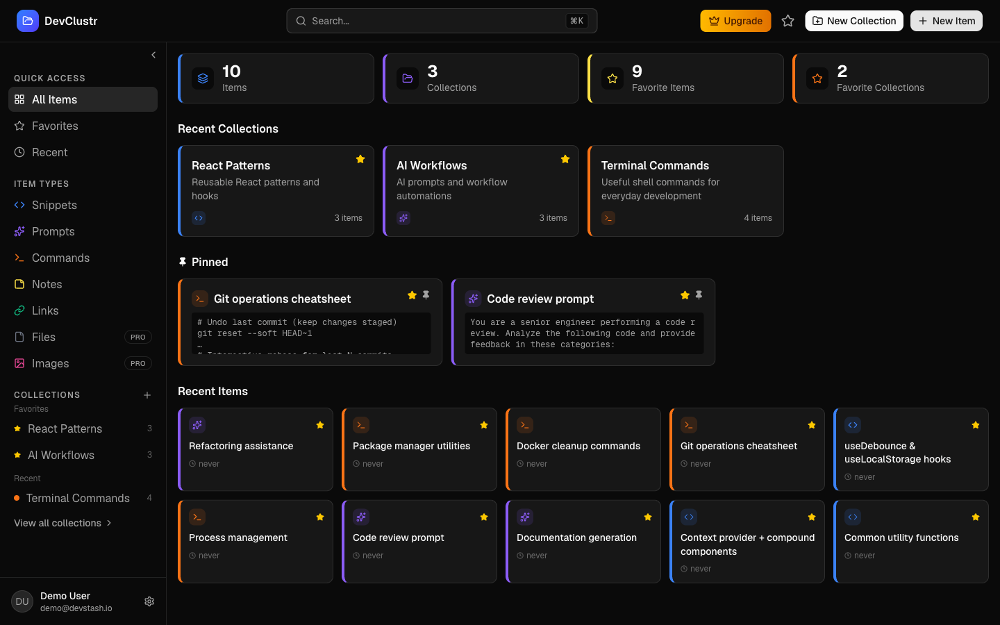
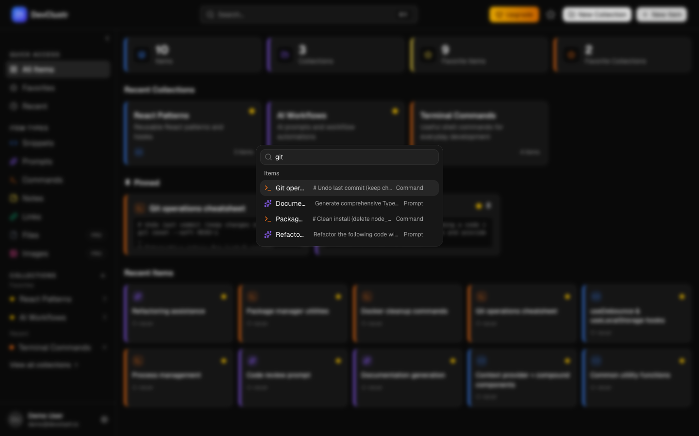
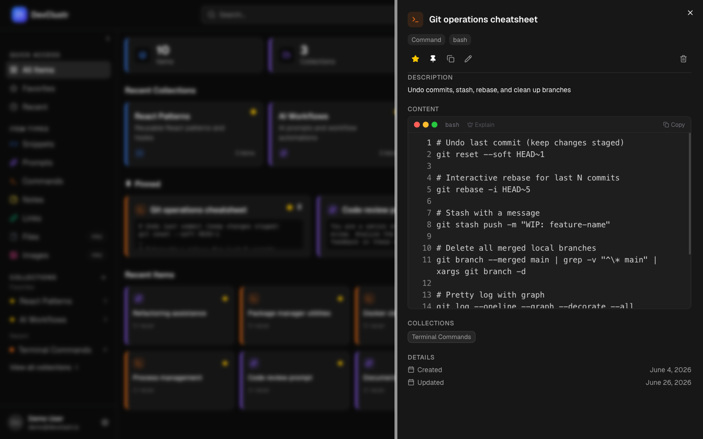
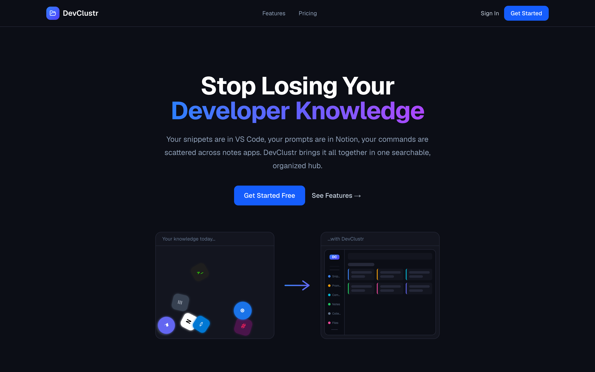

# DevClustr

**Your developer brain, in one place.**

🔗 **Live app: [devclustr.io](https://devclustr.io/)**



Snippets in VS Code. Prompts buried in chat history. Commands lost in bash history. Links scattered across a dozen bookmark folders. DevClustr pulls all of it into one fast, searchable, AI-assisted hub, so the thing you need is always one keystroke away.

---

## Why DevClustr?

Every developer builds up a personal toolkit over time, and most of us keep it in far too many places:

| Where it lives today   | What's hiding there |
| ---------------------- | ------------------- |
| VS Code / Notion       | Code snippets       |
| ChatGPT / Claude chats | AI prompts          |
| Bash history           | Terminal commands   |
| Browser bookmarks      | Useful links        |
| Random folders         | Notes, files, docs  |

DevClustr gives every one of those a home, organizes them the way you think, and finds them instantly.

---

## Features

### Everything has a home
Seven built-in item types, each color-coded so you can scan your library at a glance:

- 🟦 **Snippets**: code with syntax highlighting in a Monaco-powered editor
- 🟪 **Prompts**: your best AI prompts, ready to reuse
- 🟧 **Commands**: the terminal one-liners you always forget
- 🟨 **Notes**: Markdown notes with live preview
- 🟩 **Links**: bookmarks with context
- ⬜ **Files** and 🩷 **Images**: upload and download your assets (Pro)

### Find anything in a keystroke
Press <kbd>⌘</kbd> <kbd>K</kbd> to open the command palette and search across titles, content, tags and types. Open the result straight into a slide-over drawer without leaving the page you're on.

### Organize your way
- **Collections** such as `React Patterns`, `Interview Prep` or `Context Files`. An item can live in as many collections as you like.
- **Tags** for cross-cutting topics
- **Favorites** and **pins** to keep your most-used items on top
- **Recently used** tracking, so the item you used yesterday is easy to find again

### AI that actually helps (Pro)
- 🏷️ **Auto-tag suggestions**: tags generated from your content
- 📝 **AI summaries**: a one-line description for any item
- 💡 **Explain this code**: a plain-English walkthrough of any snippet
- 🚀 **Prompt optimizer**: turn a rough prompt into a sharper one

### Built for developers
- Dark mode by default, light mode if you prefer
- Editor preferences such as font size, tab size and theme
- Responsive layout, with a sidebar that becomes a drawer on mobile
- Sign in with email and password or with **GitHub**

---

## Screenshots

| ⌘K command palette | Item drawer |
| :---: | :---: |
|  |  |

<p align="center">
  
</p>

---

## Pricing

|                      | **Free** | **Pro** ($8/mo or $72/yr) |
| -------------------- | :------: | :-----------------------: |
| Items                | 50       | Unlimited                 |
| Collections          | 3        | Unlimited                 |
| Snippets, prompts, commands, notes, links | ✅ | ✅           |
| File & image uploads | —        | ✅                        |
| AI features          | —        | ✅                        |

---

## Tech Stack

| Layer        | Technology                                                      |
| ------------ | --------------------------------------------------------------- |
| Framework    | Next.js 16 (App Router), React 19, React Compiler, TypeScript   |
| Database     | Neon (serverless PostgreSQL) with Prisma 7                      |
| Auth         | NextAuth v5 with credentials and GitHub OAuth, email verification via Resend |
| Payments     | Stripe Checkout, Customer Portal and webhooks                   |
| File storage | Cloudflare R2                                                   |
| AI           | OpenAI `gpt-4o-mini`                                            |
| UI           | Tailwind CSS v4, shadcn/ui, cmdk, Monaco Editor, Lucide icons   |
| Rate limiting| Upstash Redis                                                   |
| Testing      | Vitest                                                          |

---

## Getting Started

### Prerequisites
- Node.js 20+
- A [Neon](https://neon.tech) PostgreSQL database
- Optional, for the full feature set: GitHub OAuth app, Resend, Stripe, Cloudflare R2, OpenAI and Upstash accounts

### Setup

```bash
git clone https://github.com/Shamsugado/devclustr.git
cd devclustr
npm install                # also runs `prisma generate`
cp .env.example .env       # fill in your keys
npm run db:migrate         # apply migrations
npm run db:seed            # optional: seed system types and demo data
npm run dev                # http://localhost:3000
```

> Tip: set `EMAIL_VERIFICATION_ENABLED=false` in development if you don't have a Resend domain configured. Leave the Upstash variables empty to turn off rate limiting locally.

### Scripts

| Command              | Description                     |
| -------------------- | ------------------------------- |
| `npm run dev`        | Start the dev server            |
| `npm run build`      | Production build                |
| `npm run start`      | Serve the production build      |
| `npm run lint`       | Run ESLint                      |
| `npm test`           | Run unit tests (Vitest)         |
| `npm run db:studio`  | Open Prisma Studio              |

---

## License

All rights reserved © Shamsu Gado.
